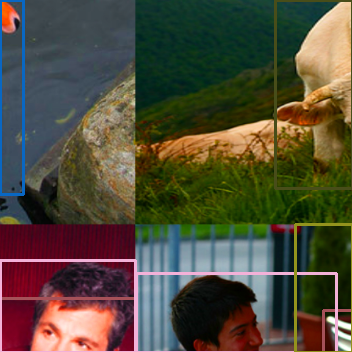
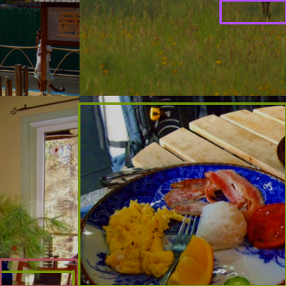
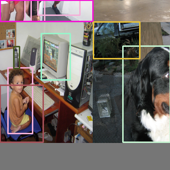
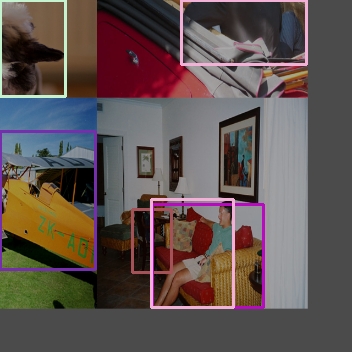

# FreeYOLOv2
English | [简体中文](https://github.com/yjh0410/FreeYOLOv2/blob/main/README_CN.md)


## Requirements
- We recommend you to use Anaconda to create a conda environment:
```Shell
conda create -n yolo python=3.6
```

- Then, activate the environment:
```Shell
conda activate yolo
```

- Requirements:
```Shell
pip install -r requirements.txt 
```

My environment:
- PyTorch = 1.9.1
- Torchvision = 0.10.1

At least, please make sure your torch is version 1.x.

## Tricks
- [x] [Mosaic Augmentation](https://github.com/yjh0410/FreeYOLO/blob/master/dataset/transforms.py)
- [x] [Mixup Augmentation](https://github.com/yjh0410/FreeYOLO/blob/master/dataset/transforms.py)
- [x] Multi scale training
- [x] Cosine Annealing Schedule

## Training Configuration
|   Configuration         |                            |
|-------------------------|----------------------------|
| Per GPU Batch Size      | 16 (8 for FreeYOLOv2-Huge) |
| Init Lr                 | 0.01                       |
| Warmup Scheduler        | Linear                     |
| Lr Scheduler            | Linear                     |
| Optimizer               | SGD                        |
| Multi Scale Train       | True                       |
| Mosaic                  | True                       |
| Mixup                   | True                       |


## Experiments
### COCO
- Download COCO.
```Shell
cd <FreeYOLOv2_HOME>
cd dataset/scripts/
sh COCO2017.sh
```

- Check COCO
```Shell
cd <FreeYOLOv2_HOME>
python dataset/coco.py
```

- Train on COCO

For example:
```Shell
python train.py --cuda -d coco -v yolo_free_v2_nano -bs 16 --max_epoch 300 --wp_epoch 3 --eval_epoch 10 --fp16 --ema --root path/to/COCO
```

**P5-Model on COCO:**

- FreeYOLOv2

| Model             | Scale |  IP  | AP<sup>val<br>0.5:0.95 | AP<sup>test<br>0.5:0.95 | FPS<sup>3090<br>FP32-bs1 | FLOPs<br><sup>(G) | Params<br><sup>(M) | Weight |
|-------------------|-------|------|------------------------|-------------------------|--------------------------|-------------------|--------------------|--------|
| FreeYOLOv2-Nano   |  640  |  √   |                        |                         |                          |                   |                    |  |
| FreeYOLOv2-Small  |  640  |  √   |                        |                         |                          |                   |                    |  |
| FreeYOLOv2-Medium |  640  |  √   |                        |                         |                          |                   |                    |  |
| FreeYOLOv2-Large  |  640  |  √   |                        |                         |                          |                   |                    |  |
| FreeYOLOv2-Huge   |  640  |  √   |                        |                         |                          |                   |                    |  |

*All FLOPs are measured with a 640x640 image size on COCO val2017. The FPS is measured with batch size 1 on 3090 GPU from the model inference to the NMS operation.*


### WiderFace
- Download [WiderFace](http://shuoyang1213.me/WIDERFACE/).

- Prepare WiderFace
```
WiderFace
|_ WIDER_train
|  |_ images
|     |_ 0--Parade
|     |_ ...
|_ WIDER_tval
|  |_ images
|     |_ 0--Parade
|     |_ ...
|_ wider_face_split
|_ eval_tools
```

- Convert WiderFace to COCO format.
```Shell
cd <FreeYOLOv2_HOME>
python tools/convert_widerface_to_coco.py --root path/to/WiderFace
```

- Check WiderFace
```Shell
cd <FreeYOLOv2_HOME>
python dataset/widerface.py
```

- Train on WiderFace
For example:
```Shell
python train.py --cuda -d widerface --root path/to/WiderFace -v yolo_free_v2_nano -bs 16 --max_epoch 100 --wp_epoch 1 --eval_epoch 10 --fp16 --ema --pretrained path/to/coco/yolo_free_v2_nano_coco.pth --mosaic 0.5 --mixup 0.0 --min_box_size 1
```

Main results on WiderFace-val:

| Model             |  Scale  |    AP    |    AP50    |  Weight  |
|-------------------|---------|----------|------------|----------|
| FreeYOLOv2-Nano   |  640    |      |        |  |
| FreeYOLOv2-Small  |  640    |      |        |  |
| FreeYOLOv2-Medium |  640    |      |        |  |
| FreeYOLOv2-Large  |  640    |      |        |  |
| FreeYOLOv2-Huge   |  640    |      |        |  |


### CrowdHuman
- Download [CrowdHuman](https://www.crowdhuman.org/).
```
CrowdHuman
|_ CrowdHuman_train01.zip
|_ CrowdHuman_train02.zip
|_ CrowdHuman_train03.zip
|_ CrowdHuman_val.zip
|_ annotation_train.odgt
|_ annotation_val.odgt
```

- Prepare CrowdHuman
```
CrowdHuman
|_ CrowdHuman_train
|  |_ Images
|     |_ 273271,1a0d6000b9e1f5b7.jpg
|     |_ ...
|_ CrowdHuman_val
|  |_ Images
|     |_ 273271,1b9330008da38cd6.jpg
|     |_ ...
|_ annotation_train.odgt
|_ annotation_val.odgt
```

- Convert CrowdHuman to COCO format.
```Shell
cd <FreeYOLOv2_HOME>
python tools/convert_crowdhuman_to_coco.py --root path/to/CrowdHuman
```

- Check CrowdHuman
```Shell
cd <FreeYOLOv2_HOME>
python dataset/crowdhuman.py
```

- Train on CrowdHuman

For example:
```Shell
python train.py --cuda -d crowdhuman -v yolo_free_v2_nano -bs 16 --max_epoch 100 --wp_epoch 1 --eval_epoch 10 --fp16 --ema --root path/to/CrowdHuman --pretrained path/to/coco/yolo_free_v2_nano.pth
```

Main results on CrowdHuman-val:

| Model            |  Scale  |    AP    |    AP50    |  Weight  |
|------------------|---------|----------|------------|----------|
| FreeYOLOv2-Nano   |  640    |      |        |  |
| FreeYOLOv2-Small  |  640    |      |        |  |
| FreeYOLOv2-Medium |  640    |      |        |  |
| FreeYOLOv2-Large  |  640    |      |        |  |
| FreeYOLOv2-Huge   |  640    |      |        |  |


## Train
### Single GPU
```Shell
sh train.sh
```

You can change the configurations of `train.sh`, according to your own situation.

You also can add `--vis_tgt`  to check the images and targets during the training stage. For example:
```Shell
python train.py --cuda -d coco --root path/to/coco -v yolo_free_v2_large --vis_tgt
```






### Multi GPUs
```Shell
sh train_ddp.sh
```

You can change the configurations of `train_ddp.sh`, according to your own situation.

**In the event of a training interruption**, you can pass `--resume` the latest training
weight path (`None` by default) to resume training. For example:

```Shell
python train.py \
        --cuda \
        -d coco \
        -v yolo_free_v2_large \
        -bs 16 \
        --max_epoch 300 \
        --wp_epoch 3 \
        --eval_epoch 10 \
        --ema \
        --fp16 \
        --resume weights/coco/yolo_free_v2_large/yolo_free_v2_large_epoch_151_39.24.pth
```

Then, training will continue from 151 epoch.

## Test
```Shell
python test.py -d coco \
               --cuda \
               -v yolo_free_v2_large \
               --img_size 640 \
               --weight path/to/weight \
               --root path/to/dataset/ \
               --show
```

## Evaluation
```Shell
python eval.py -d coco-val \
               --cuda \
               -v yolo_free_v2_large \
               --img_size 640 \
               --weight path/to/weight \
               --root path/to/dataset/ \
               --show
```

## Demo
I have provide some images in `data/demo/images/`, so you can run following command to run a demo:

```Shell
python demo.py --mode image \
               --path_to_img data/demo/images/ \
               -v yolo_free_v2_large \
               --img_size 640 \
               --cuda \
               --weight path/to/weight
```

If you want run a demo of streaming video detection, you need to set `--mode` to `video`, and give the path to video `--path_to_vid`。

```Shell
python demo.py --mode video \
               --path_to_img data/demo/videos/your_video \
               -v yolo_free_v2_large \
               --img_size 640 \
               --cuda \
               --weight path/to/weight
```

If you want run video detection with your camera, you need to set `--mode` to `camera`。

```Shell
python demo.py --mode camera \
               -v yolo_free_v2_large \
               --img_size 640 \
               --cuda \
               --weight path/to/weight
```

## Train on ourself dataset
Besides the popular datasets, we can also train the model on ourself dataset. To achieve this goal, you should follow these steps:
- Step-1: Prepare the images (JPG/JPEG/PNG ...) and use `labelimg` to make XML format annotation files.

```
OurDataset
|_ train
|  |_ images     
|     |_ 0.jpg
|     |_ 1.jpg
|     |_ ...
|  |_ annotations
|     |_ 0.xml
|     |_ 1.xml
|     |_ ...
|_ val
|  |_ images     
|     |_ 0.jpg
|     |_ 1.jpg
|     |_ ...
|  |_ annotations
|     |_ 0.xml
|     |_ 1.xml
|     |_ ...
|  ...
```
You can refer the format of `dataset/OurDataset/` which has been provided in this project.

- Step-2: Convert ourdataset to COCO format.

```Shell
cd <FreeYOLOv2_HOME>
cd tools
# convert train split
python convert_ours_to_coco.py --root path/to/OurDataset/ --split train
# convert val split
python convert_ours_to_coco.py --root path/to/OurDataset/ --split val
```
Then, we can get a `train.json` file and a `val.json` file, as shown below.
```
OurDataset
|_ train
|  |_ images     
|     |_ 0.jpg
|     |_ 1.jpg
|     |_ ...
|  |_ annotations
|     |_ 0.xml
|     |_ 1.xml
|     |_ ...
|     |_ train.json
|_ val
|  |_ images     
|     |_ 0.jpg
|     |_ 1.jpg
|     |_ ...
|  |_ annotations
|     |_ 0.xml
|     |_ 1.xml
|     |_ ...
|     |_ val.json
|  ...
```

- Step-3 Define our class labels.

Please open `dataset/ourdataset.py` file and change `our_class_labels = ('cat',)` according to our definition of categories.

- Step-4 Check

```Shell
cd <FreeYOLOv2_HOME>
cd dataset
# convert train split
python ourdataset.py --root path/to/OurDataset/ --split train
# convert val split
python ourdataset.py --root path/to/OurDataset/ --split val
```

- Step-5 **Train**

For example:

```Shell
cd <FreeYOLOv2_HOME>
python train.py --root path/to/OurDataset/ -d ourdataset -v yolo_free_v2_nano -bs 16 --max_epoch 100 --wp_epoch 1 --eval_epoch 5 -p path/to/yolo_free_tiny_coco.pth
```

- Step-6 **Test**

For example:

```Shell
cd <FreeYOLOv2_HOME>
python test.py --root path/to/OurDataset/ -d ourdataset -v yolo_free_v2_nano --weight path/to/checkpoint --show
```

- Step-7 **Eval**

For example:

```Shell
cd <FreeYOLOv2_HOME>
python eval.py --root path/to/OurDataset/ -d ourdataset -v yolo_free_v2_nano --weight path/to/checkpoint
```

## Deployment
1. [ONNX export and an ONNXRuntime](./deployment/ONNXRuntime/)
2. [OpenVINO in C++ and Python](./deployment/OpenVINO)
