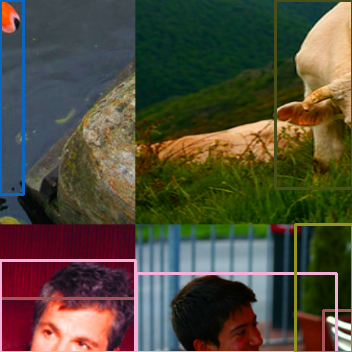

# FreeYOLOv2

## 配置运行环境
- 首先，我们建议使用Anaconda来创建一个conda的虚拟环境
```Shell
conda create -n yolo python=3.6
```

- 然后, 请激活已创建的虚拟环境
```Shell
conda activate yolo
```

- 接着，配置环境:
```Shell
pip install -r requirements.txt 
```

项目作者所使用的环境配置:
- PyTorch = 1.9.1
- Torchvision = 0.10.1

为了能够正常运行该项目的代码，请确保您的torch版本为1.x系列。

## FreeYOLOv2使用到的训练技巧
- [x] [马赛克增强](https://github.com/yjh0410/FreeYOLO/blob/master/dataset/transforms.py)
- [x] [混合增强](https://github.com/yjh0410/FreeYOLO/blob/master/dataset/transforms.py)
- [x] 多尺度训练
- [x] 余弦退火学习策略

## 训练配置
|   配置                  |                            |
|------------------------|----------------------------|
| 单个GPU上的batch size   | 16 (对于FreeYOLOv2-Huge，应设置为8) |
| 初始学习率              | 0.01                       |
| Warnmup策略            | 线性warmup策略              |
| 学习率策略              | 余弦退火                    |
| 训练优化器              | SGD                        |
| 多尺度训练              | True                       |
| 马赛克增强              | True                       |
| 混合增强                | True                       |

## 实验结果
### COCO
- 下载 COCO.
```Shell
cd <FreeYOLOv2_HOME>
cd dataset/scripts/
sh COCO2017.sh
```

- 检查 COCO
```Shell
cd <FreeYOLOv2_HOME>
python dataset/coco.py
```

当COCO数据集的路径修改正确后，运行上述命令应该会看到COCO数据的可视化图像。

- 使用COCO训练模型

For example:
```Shell
python train.py --cuda -d coco -v yolo_free_v2_tiny -bs 16 --max_epoch 300 --wp_epoch 3 --eval_epoch 10 --fp16 --ema --root path/to/COCO
```

**P5-Model on COCO:**

| Model             | Scale | FPS<sup>3090<br>FP32-bs1 | AP<sup>val<br>0.5:0.95 | FLOPs<br><sup>(G) | Params<br><sup>(M) | Weight |
|-------------------|-------|--------------------------|------------------------|-------------------|--------------------|--------|
| FreeYOLOv2-Nano   |  640  |           100            |          35.3          |       8.3         |       2.8          | [ckpt](https://github.com/yjh0410/FreeYOLOv2/releases/download/yolo_free_v2_ckpt/yolo_free_v2_nano_coco.pth) |
| FreeYOLOv2-Small  |  640  |                          |                        |                   |                    |  |
| FreeYOLOv2-Medium |  640  |                          |                        |                   |                    |  |
| FreeYOLOv2-Large  |  640  |                          |                        |                   |                    |  |
| FreeYOLOv2-Huge   |  640  |                          |                        |                   |                    |  |


### WiderFace
- 下载 [WiderFace](http://shuoyang1213.me/WIDERFACE/).

- 按照下面的格式准备 WiderFace
```
WiderFace
|_ WIDER_train
|  |_ images
|     |_ 0--Parade
|     |_ ...
|_ WIDER_tval
|  |_ images
|     |_ 0--Parade
|     |_ ...
|_ wider_face_split
|_ eval_tools
```

- 将 WiderFace 数据集的标签转换为 COCO 数据集的格式，即得到.json文件.
```Shell
cd <FreeYOLOv2_HOME>
python tools/convert_widerface_to_coco.py --root path/to/WiderFace
```

- 检查  WiderFace
```Shell
cd <FreeYOLOv2_HOME>
python dataset/widerface.py
```

当 WiderFace 数据集的路径修改正确后，运行上述命令应该会看到 WiderFace 数据的可视化图像，表明转换步骤顺利成功。

- 使用 WiderFace训练FreeYOLOv2

例如:
```Shell
python train.py --cuda -d widerface --root path/to/WiderFace -v yolo_free_v2_tiny -bs 16 --max_epoch 100 --wp_epoch 1 --eval_epoch 10 --fp16 --ema --pretrained path/to/coco/yolo_free_v2_tiny_coco.pth --mosaic 0.5 --mixup 0.0 --min_box_size 1
```

Main results on WiderFace-val:

| Model             |  Scale  |    AP    |    AP50    |  Weight  |
|-------------------|---------|----------|------------|----------|
| FreeYOLOv2-Nano   |  640    |      |        |  |
| FreeYOLOv2-Small  |  640    |      |        |  |
| FreeYOLOv2-Medium |  640    |      |        |  |
| FreeYOLOv2-Large  |  640    |      |        |  |
| FreeYOLOv2-Huge   |  640    |      |        |  |

### CrowdHuman
- 下载 [CrowdHuman](https://www.crowdhuman.org/).
```
CrowdHuman
|_ CrowdHuman_train01.zip
|_ CrowdHuman_train02.zip
|_ CrowdHuman_train03.zip
|_ CrowdHuman_val.zip
|_ annotation_train.odgt
|_ annotation_val.odgt
```

- 准备 CrowdHuman
```
CrowdHuman
|_ CrowdHuman_train
|  |_ Images
|     |_ 273271,1a0d6000b9e1f5b7.jpg
|     |_ ...
|_ CrowdHuman_val
|  |_ Images
|     |_ 273271,1b9330008da38cd6.jpg
|     |_ ...
|_ annotation_train.odgt
|_ annotation_val.odgt
```

- 将 CrowdHuman 数据集的标签转换为 COCO 数据集的格式，即得到.json文件.
```Shell
cd <FreeYOLOv2_HOME>
python tools/convert_crowdhuman_to_coco.py --root path/to/CrowdHuman
```

- 检查 CrowdHuman
```Shell
cd <FreeYOLOv2_HOME>
python dataset/crowdhuman.py
```

当 CrowdHuman 数据集的路径修改正确后，运行上述命令应该会看到 CrowdHuman 数据的可视化图像，表明转换步骤顺利成功。

- 使用 CrowdHuman 训练FreeYOLOv2

例如:
```Shell
python train.py --cuda -d crowdhuman -v yolo_free_v2_tiny -bs 16 --max_epoch 100 --wp_epoch 1 --eval_epoch 10 --fp16 --ema --root path/to/CrowdHuman --pretrained path/to/coco/yolo_free_v2_tiny.pth
```

Main results on CrowdHuman-val:

| Model             |  Scale  |    AP    |    AP50    |  Weight  |
|-------------------|---------|----------|------------|----------|
| FreeYOLOv2-Nano   |  640    |      |        |  |
| FreeYOLOv2-Small  |  640    |      |        |  |
| FreeYOLOv2-Medium |  640    |      |        |  |
| FreeYOLOv2-Large  |  640    |      |        |  |
| FreeYOLOv2-Huge   |  640    |      |        |  |

## 训练
### 使用单个GPU来训练
```Shell
sh train.sh
```

使用者可以根据自己的情况来调整`train.sh`文件中的配置，以便在自己的本地上顺利训练模型。

如果使用者想查看训练时所使用的数据，可以在训练命令中输入`--vsi_tgt`参数，例如：
```Shell
python train.py --cuda -d coco --root path/to/coco -v yolo_free_v2_large --vis_tgt
```

下面展示了四张训练数据的可视化图像：




### 使用多个GPU来训练
```Shell
sh train_ddp.sh
```

使用者可以根据自己的情况来调整`train_ddp.sh`文件中的配置，以便在自己的本地上顺利训练模型。

**当训练突然中断时**, 使用者可以在训练命令中传入`--resume`参数，并指定最新保存的权重文件（默认为`None`），以便继续训练。例如：

```Shell
python train.py \
        --cuda \
        -d coco \
        -v yolo_free_v2_large \
        -bs 16 \
        --max_epoch 300 \
        --wp_epoch 3 \
        --eval_epoch 10 \
        --ema \
        --fp16 \
        --resume weights/coco/yolo_free_v2_large/yolo_free_v2_large_epoch_151_39.24.pth
```

## 测试
使用者可以参考下面的给出的例子在相应的数据集上去测试训练好的模型，正常情况下，使用者将会看到检测结果的可视化图像。

```Shell
python test.py -d coco \
               --cuda \
               -v yolo_free_v2_large \
               --img_size 640 \
               --weight path/to/weight \
               --root path/to/dataset/ \
               --show
```

## 验证
使用者可以参考下面的给出的例子在相应的数据集上去验证训练好的模型，正常情况下，使用者将会看到COCO风格的AP结果输出。

```Shell
python eval.py -d coco-val \
               --cuda \
               -v yolo_free_v2_large \
               --img_size 640 \
               --weight path/to/weight \
               --root path/to/dataset/ \
               --show
```

如果使用者想测试模型在COCO test-dev数据集上的AP指标，可以遵循以下步骤：

- 将上述命令中的`coco-val`修改为`coco-test`，然后运行；
- 运行结束后，将会得到一个名为`coco_test-dev.json`的文件；
- 将其压缩为一个`.zip`，按照COCO官方的要求修改压缩文件的名称，例如``;
- 按照COCO官方的要求，将该文件上传至官方的服务器去计算AP。

## Demo
本项目在`data/demo/images/`文件夹中提供了一些图片，使用者可以运行下面的命令来测试本地的图片：

```Shell
python demo.py --mode image \
               --path_to_img data/demo/images/ \
               -v yolo_free_v2_large \
               --img_size 640 \
               --cuda \
               --weight path/to/weight
```

如果使用者想在本地的视频上去做测试，那么你需要将上述命令中的`--mode image`修改为`--mode video`，并给`--path_to_vid`传入视频所在的文件路径，例如：

```Shell
python demo.py --mode video \
               --path_to_img data/demo/videos/your_video \
               -v yolo_free_v2_large \
               --img_size 640 \
               --cuda \
               --weight path/to/weight
```

如果使用者想用本地的摄像头（如笔记本的摄像头）去做测试，那么你需要将上述命令中的`--mode image`修改为`--mode camera`，例如：

```Shell
python demo.py --mode camera \
               -v yolo_free_v2_large \
               --img_size 640 \
               --cuda \
               --weight path/to/weight
```

## 使用我们自己的数据集来训练
本项目同样支持在本地数据集上的训练，不过，为了实现这一目的，需要使用者遵循以下的步骤：

- 步骤1：使用`labelimg`工具来标注已准备好的图片（JPG/JPEG/PNG ...），并得到相应的`.xml`格式的标签文件。请使用者按照如下的格式来准备自己的数据集。

```
OurDataset
|_ train
|  |_ images     
|     |_ 0.jpg
|     |_ 1.jpg
|     |_ ...
|  |_ annotations
|     |_ 0.xml
|     |_ 1.xml
|     |_ ...
|_ val
|  |_ images     
|     |_ 0.jpg
|     |_ 1.jpg
|     |_ ...
|  |_ annotations
|     |_ 0.xml
|     |_ 1.xml
|     |_ ...
|  ...
```

本项目在 `dataset/OurDataset/` 中提供了一个本地数据集的例子，以供使用者参考。

- 步骤2：将本地数据集转换为 COCO 格式。

```Shell
cd <FreeYOLOv2_HOME>
cd tools
# 转换训练集
python convert_ours_to_coco.py --root path/to/OurDataset/ --split train
# 转换验证集
python convert_ours_to_coco.py --root path/to/OurDataset/ --split val
```

然后，我们就会得到相应的 `train.json` 和 `val.json` 两个文件，如下所示：
```
OurDataset
|_ train
|  |_ images     
|     |_ 0.jpg
|     |_ 1.jpg
|     |_ ...
|  |_ annotations
|     |_ 0.xml
|     |_ 1.xml
|     |_ ...
|     |_ train.json
|_ val
|  |_ images     
|     |_ 0.jpg
|     |_ 1.jpg
|     |_ ...
|  |_ annotations
|     |_ 0.xml
|     |_ 1.xml
|     |_ ...
|     |_ val.json
|  ...
```

- 步骤3：定义我们的类别标签。

请使用者打开 `dataset/ourdataset.py` 文件，然后修改其中的 `our_class_labels = ('cat',)` 变量，修改其中的类别标签。

- 步骤4：检查本地数据集

```Shell
cd <FreeYOLOv2_HOME>
cd dataset
# 检查训练集
python ourdataset.py --root path/to/OurDataset/ --split train
# 检查验证集
python ourdataset.py --root path/to/OurDataset/ --split val
```

- 步骤5：**训练**

运行命令可参考下面的代码:

```Shell
cd <FreeYOLOv2_HOME>
python train.py --root path/to/OurDataset/ -d ourdataset -v yolo_free_v2_tiny -bs 16 --max_epoch 100 --wp_epoch 1 --eval_epoch 5 -p path/to/yolo_free_tiny_coco.pth
```

- Step-6 **测试**

运行命令可参考下面的代码:

```Shell
cd <FreeYOLOv2_HOME>
python test.py --root path/to/OurDataset/ -d ourdataset -v yolo_free_v2_tiny --weight path/to/checkpoint --show
```

- Step-7 **验证**

运行命令可参考下面的代码:

```Shell
cd <FreeYOLOv2_HOME>
python eval.py --root path/to/OurDataset/ -d ourdataset -v yolo_free_v2_tiny --weight path/to/checkpoint
```

## 部署
1. [ONNX export and an ONNXRuntime](./deployment/ONNXRuntime/)
2. [OpenVINO in C++ and Python](./deployment/OpenVINO)


